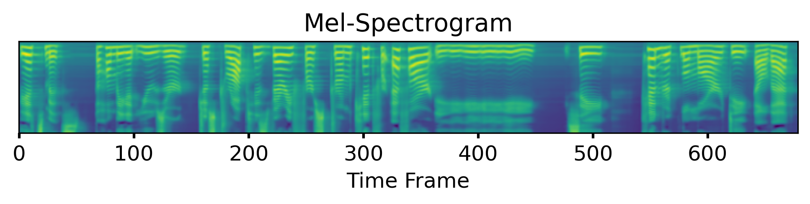

# Subvocal Representations of Natural Language for Text Classification

_Def:_ Internal dialog or subvocalization commonly occurs during silent reading where individuals silently speak or hear the text that is read – _did you notice as you read this?_

In this work we join the textual features and generated audio sequences of text-only data in a neural network to better model the process of subvocalization.

## Repository Layout

- **Paper** [ [docs/subvocal-paper.pdf](docs/subvocal-paper.pdf) ]
  - Discussion, implementation, and findings of the multimodal network
- **Network** [ [src/textneuralnetworks.py](textneuralnetworks.py) ]
  - Implemented in PyTorch and used for the text-lstm, text-cnn, audio, and combined model
- **Notebook** [ [notebooks/tweeteval.ipynb](notebooks/tweeteval.ipynb) ]
  - Evaluations and exploritory results on the [TweetEval Benchmark](https://arxiv.org/pdf/2010.12421.pdf)
- **FastPitch** [ [scripts/fastpitch.sh](scripts/fastpitch.sh) ]
  - Generates synthetic mel-spectrograms from text sequences